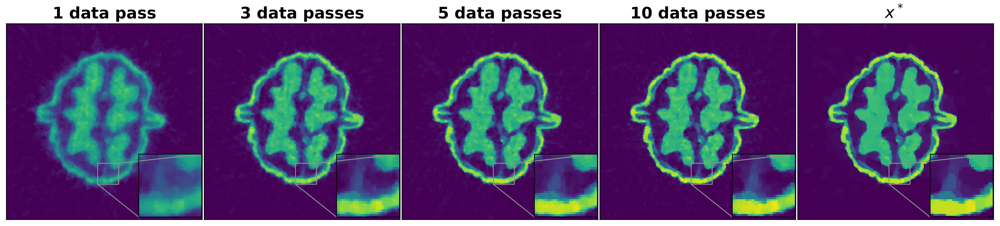
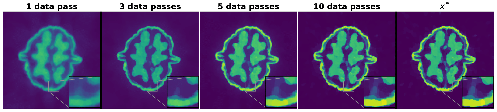
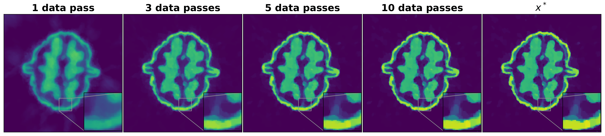

# Stochastic Optimisation for Large-Scale Inverse Problems

This repository contains the implementation of the numerical experiments for the paper [A Guide to Stochastic Optimisation for Large-Scale Inverse Problems](https://arxiv.org/abs/2406.06342)

If you have any questions please contact the authors

## Usage

We use the [Core Imaging Library](https://github.com/TomographicImaging/CIL) for tomographic imaging and as a baseline for reconstruction algorithms. To install CIL you may run
```
conda create --name cil -c conda-forge -c https://software.repos.intel.com/python/conda -c ccpi cil=24.2.0 ipp=2021.12
```

or follow the installation instructions on the linked github repository, where you may find further details, documentation and demos

The walnut dataset can be accessed by downloading `20201111_walnut_sinogram_data_res_280.mat` in the `202001111_walnut_sinograms` directory [here](https://zenodo.org/records/4279549)

## Contents

Results in the paper can be reproduced by running code as follows:

* Figure 4a-b:  `SheppLogan_200Epochs.py`
* Figure 4c: `SheppLogan_10Epochs.py`
* Figure 5: `SheppLogan_Sampling.py`
* Figure 6: `SheppLogan_ADAM.py` and `SheppLogan_SGDStepsize.py`
* Figure 8-9: `Walnut_Comparison.py`
* Figure 10: `Walnut_SVRGStepsizes.py`

### Sub-optimality plots for fan-beam CT reconstruction of a Walnut
<table style="border-collapse: collapse; width: 100%;">
  <tr>
    <th style="border: none; padding: 10px; text-align: center;">High Noise</th>
    <th style="border: none; padding: 10px; text-align: center;">Medium Noise</th>
    <th style="border: none; padding: 10px; text-align: center;">Low Noise</th>
  </tr>
  <tr>
    <td style="border: none; padding: 10px; text-align: center;">
      
    </td>
    <td style="border: none; padding: 10px; text-align: center;">
      
    </td>
    <td style="border: none; padding: 10px; text-align: center;">
      
    </td>
  </tr>
</table>

### Changes in the reconstruction during the first 10 epochs for medium noise
**SGD**

**SAGA**

**SVRG**

**SPDHG**

