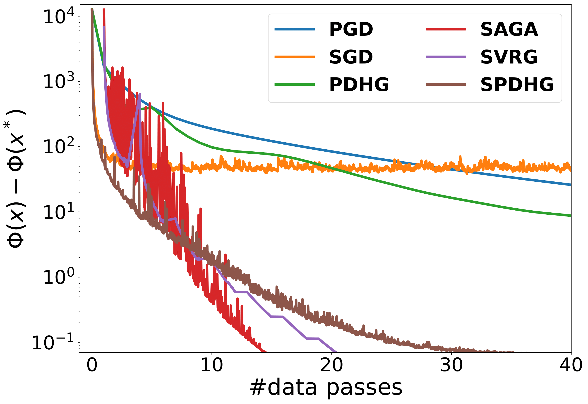
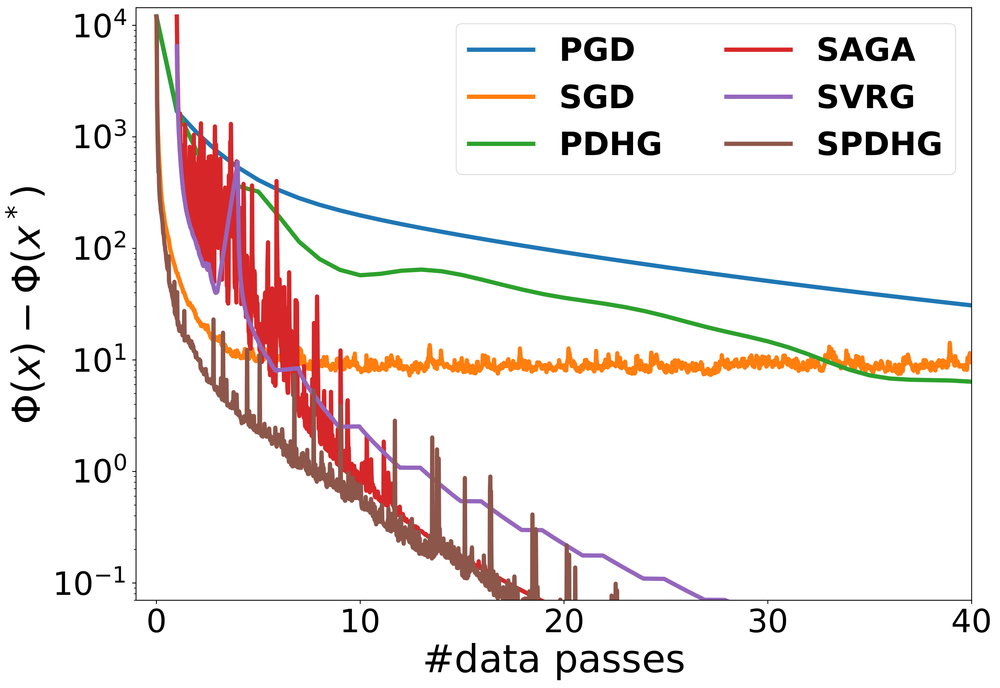
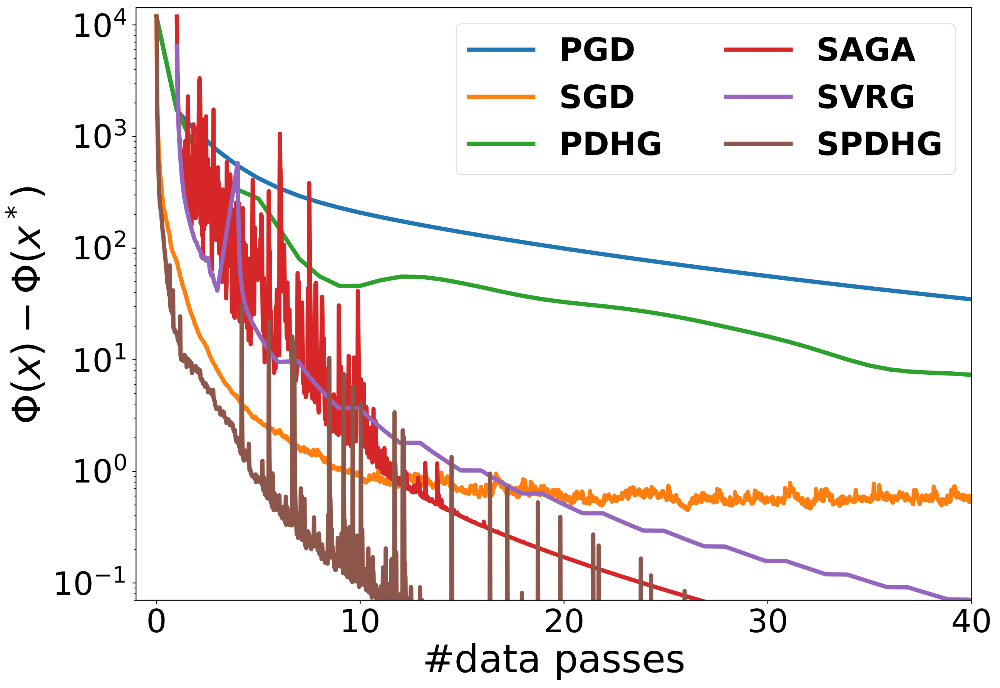

# Stochastic Optimisation for Large-Scale Inverse Problems

This repository contains the implementation of the numerical experiments for the paper [A Guide to Stochastic Optimisation for Large-Scale Inverse Problems](https://arxiv.org/abs/2406.06342)

If you have any questions please contact the authors

## Usage

We use the [Core Imaging Library](https://github.com/TomographicImaging/CIL) for tomographic imaging and as a baseline for reconstruction algorithms. To install CIL you may run
```
conda create --name cil -c conda-forge -c https://software.repos.intel.com/python/conda -c ccpi cil=24.2.0 ipp=2021.12
```

or follow the installation instructions on the linked github repository, where you may find further details, documentation and demos

The walnut dataset can be accessed by downloading `20201111_walnut_sinogram_data_res_280.mat` in the `202001111_walnut_sinograms` directory [here](https://zenodo.org/records/4279549)

## Contents

Results in the paper can be reproduced by running code as follows:

* Figure 4a-b:  `SheppLogan_200Epochs.py`
* Figure 4c: `SheppLogan_10Epochs.py`
* Figure 5: `SheppLogan_Sampling.py`
* Figure 6: `SheppLogan_ADAM.py` and `SheppLogan_SGDStepsize.py`
* Figure 8-9: `Walnut_Comparison.py`
* Figure 10: `Walnut_SVRGStepsizes.py`


<p float="left">
  
   
  
</p>


<table>
  <tr>
    <td>High Noise</td>
     <td>Medium Noise</td>
     <td>Low Noise</td>
  </tr>
  <tr>
      <td></td>
  <td></td> 
  <td></td>
  </tr>
 </table>

| High Noise | Medium Noise | Low Noise | 
| --- | --- | --- |
| | | |

<style>
  table {
    border-collapse: collapse;
  }
  table, th, td {
    border: none;
  }
  th, td {
    padding: 10px;
    text-align: center;
  }
</style>

<table>
  <tr>
    <th>High Noise</th>
    <th>Medium Noise</th>
    <th>Low Noise</th>
  </tr>
  <tr>
    <td></td>
    <td></td>
    <td></td>
  </tr>
</table>


<!--     -->